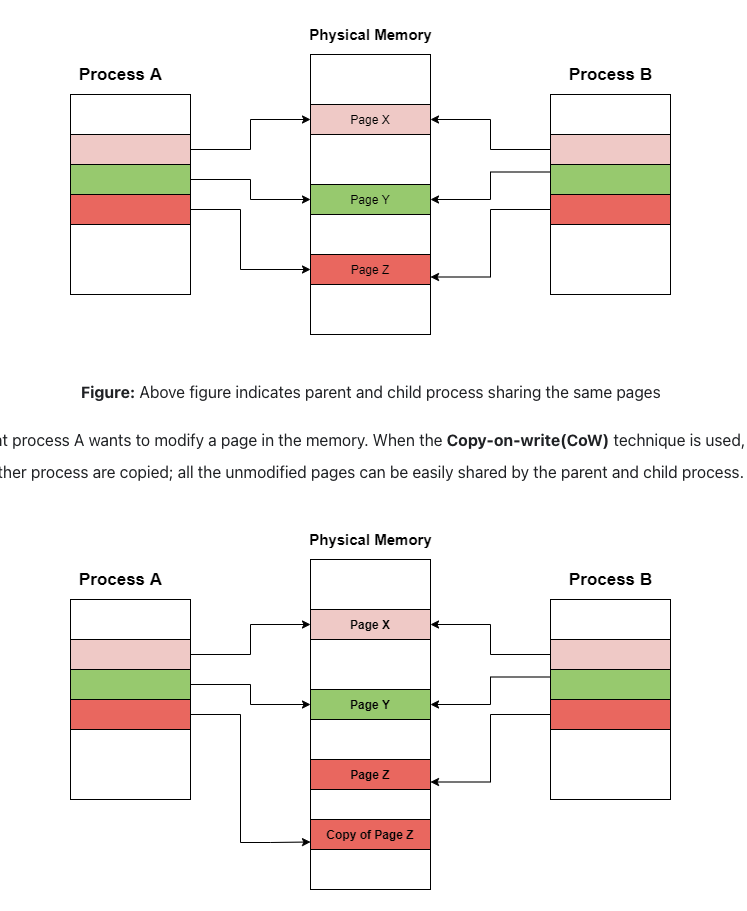

# Redis 持久化机制: RDB 和 AOF

## Redis 持久化

### 为什么需要持久化？

Redis 是基于内存的数据库，服务一旦宕机，内存中的数据将全部丢失。通常来说可以通过数据库来恢复这些数据，但这会给数据库带来非常大的读压力，并且这个过程将非常缓慢，并导致程序响应慢。因此数据的持久化就显得至关重要。

### 持久化的方式

目前 [Redis Documentation](https://redis.io/docs/management/persistence/) 上对持久化的支持有以下几种方案：

1. RDB (Redis Database): 将某个时间点上的数据生成快照 (snapshot) 并保存到硬盘上。
2. AOF (Append Only File): 将每个接收到的写操作记录到硬盘上，这些操作可以在 Redis 重启时被重放，并用于重新构建 Redis 数据库。
3. RDB + AOF: AOF 和 RDB 的混合模式。

## RDB

### 触发方式

触发rdb持久化的方式有2种，分别是手动触发和自动触发。

手动触发的方式命令分为两种：

1. `save`: 阻塞 Redis 进程，并进行 RDB 持久化，直到其完成为止，对于内存占用大的实例会造成长时间阻塞。
2. `bgsave`: background save，让 Redis 进程通过 fork 操作创建子进程，并在子进程进行 RDB 持久化，在 fork 阶段会阻塞 Redis 进程。

### 常见问题

1. 一般来说 Redis 实例占用的内存都比较大，那么在使用 bgsave 将内存数据持久化的操作将会持续较长的时间，如果在持久化的过程中，Redis 服务收到了数据写操作请求，那么这样的写操作会被持久化么？如何保证持久化前后的数据一致性？

    - RDB 利用操作系统提供的[写时复制](https://en.wikipedia.org/wiki/Copy-on-write) (Copy-on-Write) 机制来解决这样的问题。写时复制即当主进程 P fork 出子进程时 Q 时，Q 将和 P 共享同一块内存空间，当 P 准备对某块内存进行写操作时，P 会将这块内存页进行复制，并在新的副本上对数据进行修改，而 Q 仍然读取原先的内存页。这样既能够保证 Redis 实例继续服务外部流量，又能够以最小的成本完成数据的持久化，

2. 为了保证宕机时丢失的数据尽量少，是否应该以尽可能高的频率来触发 RDB（例如每分钟一次）？

    - 虽然 bgsave 在子进程中执行，不会阻塞主线程，但仍然有另外两方面的考虑：第一，bgsave 需要通过 fork 操作来创建子进程，fork 操作本身是会阻塞主进程的，并且主线程占用内存越多，fork 操作的阻塞时间越长；第二，将全量数据写入硬盘的操作会占用大量的带宽，给硬盘带来很大的压力，从而影响 Redis 实例的性能，并且如果上一次的写入操作尚未完成，就开始了下一次的写入操作，更有可能会造成恶性循环。因此触发 RDB 的频率并不是越高越好，我们需要考虑 Redis 实例占用内存的大小以及全量数据写入硬盘的速度。

### 优缺点

- 优点

    - RDB文件是某个时间节点的快照，默认使用 LZF 算法进行压缩，压缩后的文件体积远远小于内存大小，适用于定期执行（例如每一小时进行一次），并将 RDB 文件上传到数据中心进行容灾备份

    - 与AOF相比，使用 RDB 恢复大型数据集更快

- 缺点
    - RDB 方式实时性不够，无法做到秒级的持久化；
    - RDB 需要 fork 子进程，而 fork 进程执行成本非常高；
    - RDB 文件是二进制编码的，没有可读性
    
## AOF

AOF (Append Only File) 通过写日志的方式，在 Redis 每次写操作完成后在日志里记录下此次执行的命令，当服务器重启的时候通过顺序地重放这些日志来恢复数据。

**写后日志**

和 MySQL 的写前日志 (Write-Ahead Logging) 不同，AOF 会在写操作完成后记录日志，这样既能够保证 Redis 不阻塞并及时响应写操作，还可以避免运行时检查出写操作命令不合法再回滚这条日志。但如果在命令执行完之后，写日志完成之前，服务器发生了宕机，也有可能会丢失数据。

### 重写

随着时间的增加，AOF 文件体积会越来越大，导致磁盘占用空间更多，数据恢复时间更长。Redis 通过创建新的 AOF 文件，将旧文件中的多条命令整合成为新文件中的单条命令，并替换旧文件，来对 AOF 文件进行重写，从而减少 AOF 文件的体积。

### 常见问题

#### AOF重写会阻塞吗？

AOF 的重写过程是由后台进程 bgrewriteaof 来完成的。主线程 fork 出后台的 bgrewriteaof 子进程，fork 操作会把主线程的内存拷贝一份给 bgrewriteaof 子进程，这里面就包含了数据库的最新数据。然后，bgrewriteaof 子进程逐一把拷贝的数据写成操作，并记入重写日志，因此在重写过程中，只有当 fork 操作发生时会阻塞主线程。

#### 重写在何时发生？

我们可以从配置里控制重写的发生，有两个配置项：auto-aof-rewrite-min-size 控制重写时文件的最小 size，默认为 64MB；auto-aof-rewrite-percentage 代表此次重写文件和上次重写文件的大小差值，再除以上一次重写后aof文件大小。也就是当前aof文件比上一次重写后aof文件的增量大小，和上一次重写后aof文件大小的比值。

### 优缺点

AOF advantages
Using AOF Redis is much more durable: you can have different fsync policies: no fsync at all, fsync every second, fsync at every query. With the default policy of fsync every second, write performance is still great. fsync is performed using a background thread and the main thread will try hard to perform writes when no fsync is in progress, so you can only lose one second worth of writes.
The AOF log is an append-only log, so there are no seeks, nor corruption problems if there is a power outage. Even if the log ends with a half-written command for some reason (disk full or other reasons) the redis-check-aof tool is able to fix it easily.
Redis is able to automatically rewrite the AOF in background when it gets too big. The rewrite is completely safe as while Redis continues appending to the old file, a completely new one is produced with the minimal set of operations needed to create the current data set, and once this second file is ready Redis switches the two and starts appending to the new one.
AOF contains a log of all the operations one after the other in an easy to understand and parse format. You can even easily export an AOF file. For instance even if you've accidentally flushed everything using the FLUSHALL command, as long as no rewrite of the log was performed in the meantime, you can still save your data set just by stopping the server, removing the latest command, and restarting Redis again.
AOF disadvantages
AOF files are usually bigger than the equivalent RDB files for the same dataset.
AOF can be slower than RDB depending on the exact fsync policy. In general with fsync set to every second performance is still very high, and with fsync disabled it should be exactly as fast as RDB even under high load. Still RDB is able to provide more guarantees about the maximum latency even in the case of a huge write load.
Redis < 7.0

AOF can use a lot of memory if there are writes to the database during a rewrite (these are buffered in memory and written to the new AOF at the end).
All write commands that arrive during rewrite are written to disk twice.
Redis could freeze writing and fsyncing these write commands to the new AOF file at the end of the rewrite.