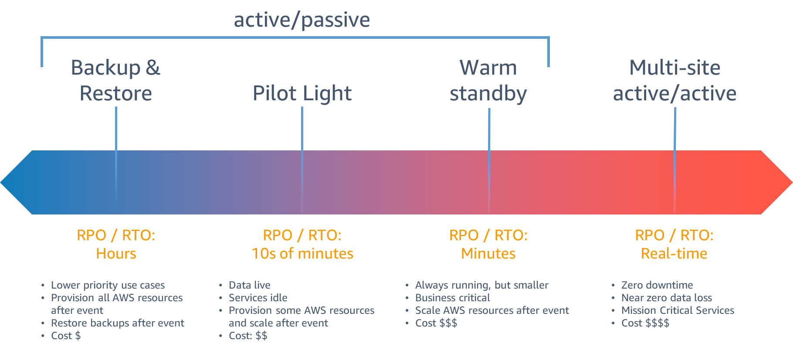
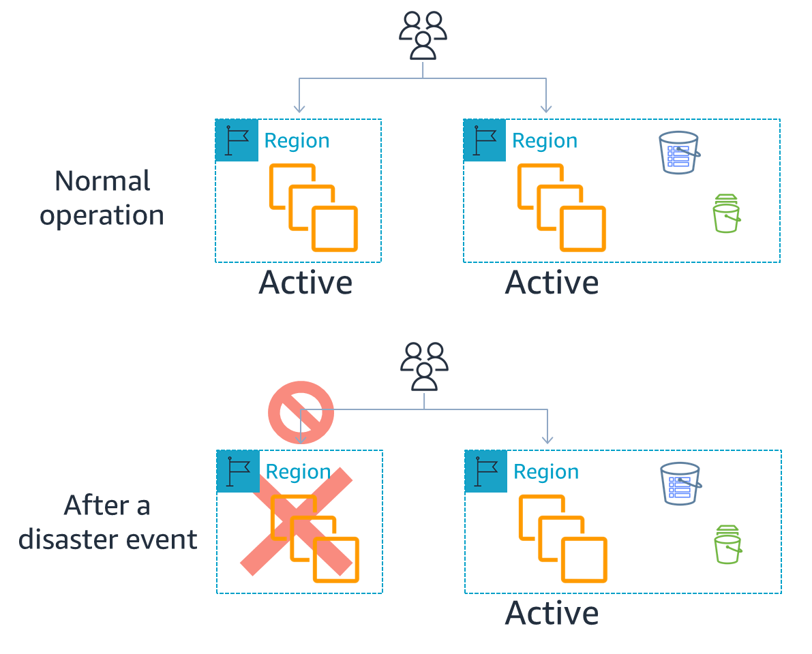
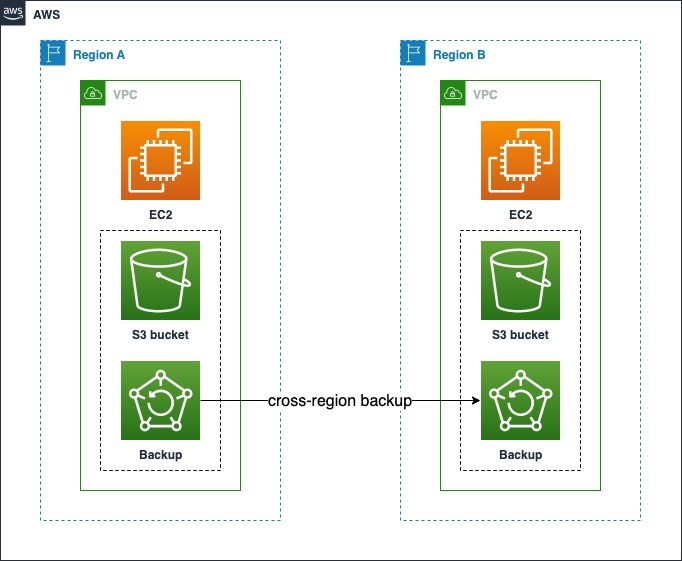
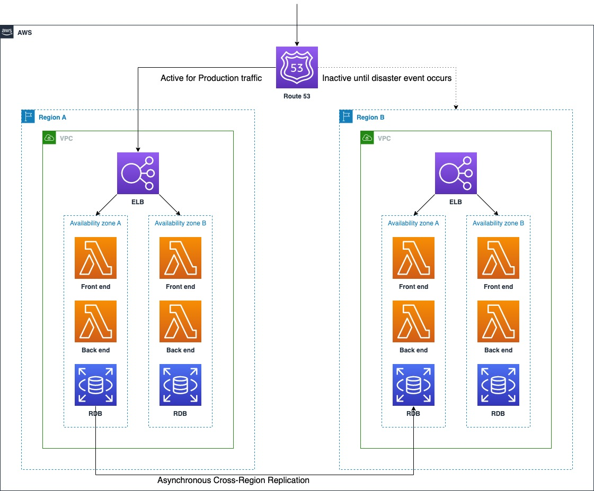
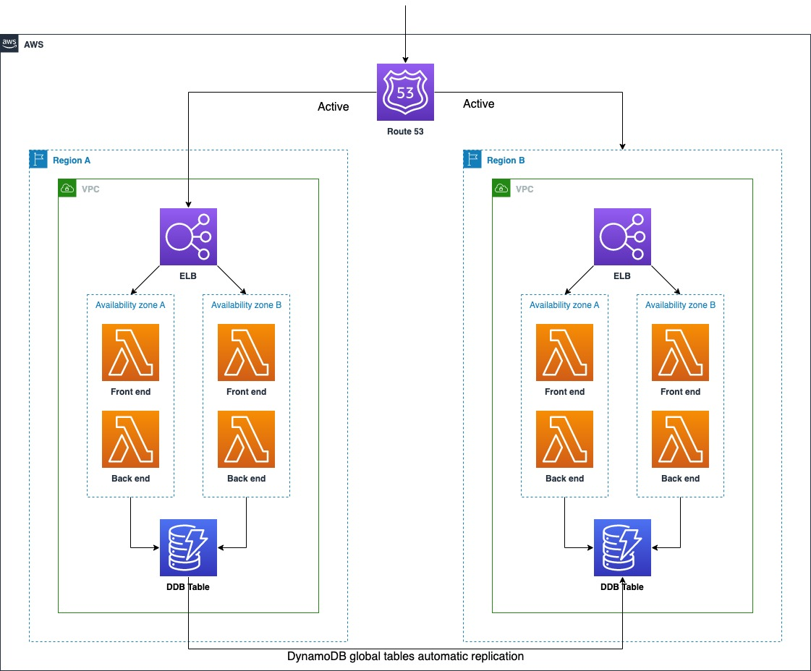

# Disaster Recovery Architecture on AWS

[TOC]

The downtime of software systems could have a significant impact on business, customer satisfaction, reputation, or income of the company. Thus maintaining the availability and durability must be the most crucial part of a software system. Disaster recovery (DR) helps engineers prepare for disaster events. This post summaries the architecture for DR on AWS.

## DR objectives

There are two key objectives:

- **Recovery time objective (RTO)**: The maximum time range between service **collapse** and service **restoration**. It represents **how quickly the service could be restarted**.
- **Recovery point objective (RPO)**: The maximum time range between data being **last backed up** and the **disaster happening**. It represents **how much loss of data is acceptable**.

We can observe from the figure above that the lower RTO and RPO are, the less recovery time and less loss of data could be. But in the meanwhile, lower RTO and RPO also take more resources, e.g, redundancy, money, and operational complexity. Therefore we need to decide on the appropriate RTO and RPO values that suites the best for our services.

## DR strategies

AWS offers four strategies for DR, as shown below.

We can observe from the figure that there are 3 types of active/passive strategies: Backup & Restore, Pilot Light, Warm Standby, and 1 type of active/active strategy: Multi-site active/active.

### Active/passive vs. active/active DR strategies

#### Active/passive strategy

From the figure below, we can see how active/passive DR strategy works.

All traffic goes to a single AWS region called **Active Region**. If a disaster event occurs and the Active Region goes down, then the region where standby servers are located becomes the **Recovery Region**. All traffic will be switched to be routed to Recovery Region, and the workload can now operate from Recovery Region. This process is called **failover**.

The 3 types of active-passive strategies are distinguished by **how tight the RTO/RPO objectives should be**, but for any type, the infrastructure should be fully or partially deployed in the Recovery Region before failover.

#### Active/active strategy

From the figure below, we can see how active/active DR strategy works.

**Two or more regions are actively accepting requests**, and **data is replicated** between these two regions. When any region undergoes a disaster event, failover happens and the traffic for that Region is routed to the remaining regions.

### Strategies

#### Backup & Restore

Backup and Restore strategy is a suitable approach for mitigating against **data loss/corruption**. This approach confronts a regional disaster event by replicating/mirroring data to other AWS Regions periodically, e.g. each 1 hour. For utilizing the data backup, the data layer and the application layer in the service architecture should be **separated**.

This strategy lowers cost and is relatively easy to implement, and these features make it a good choice for many AWS workloads.

#### Pilot Light and Warm Standby

Pilot Light and Warm Standby strategies both offer a good balance of benefits and costs. The traffic is routed to Active Region originally, and fallback turns the traffic to Recovery Region when disaster event occurs.

The similarity between these two strategies is that both include an environment in the Recovery Region with copies of Active Region assets. The distinctions are that pilot light cannot process requests without **additional action taken first**, whereas warm standby can **handle traffic immediately**. The pilot light approach requires **manual operations** to turn on servers, and possibly deploy additional infrastructure, whereas for warm standby **everything is already deployed and running**, and what we need to consider is whether we should scale up or not. Use RTO and RPO objectives to help choose between these approaches.

#### Multi-Site Active/Active

With Multi-Site Active/Active strategy, each Region hosts a **highly available workload stack**, and each stack **serves production traffic** from where it is deployed. With a multi-site active/active approach, users are able to access the workload in any of the Regions in which it is deployed. This approach is the most complex and costly one, but it can reduce recovery time to an extremely low level.

If the workload cannot operate in a region, failover will route traffic away from the impacted Region to healthy Regions. We can use Route 53 or Global Accelerator for routing and failover. Consider the multi-site active/active strategy for our workload if we require the lowest RTO lowest the RPO objectives.

## Conclusion

There is no absolute best strategy to handle disaster events for any circumstance, we may need to analyze the business needs, the expenditure, the benefits, and the risks of applying each strategy to our business.

For more about DR, refer to [Disaster recovery options in the cloud](https://docs.aws.amazon.com/whitepapers/latest/disaster-recovery-workloads-on-aws/disaster-recovery-options-in-the-cloud.html#multi-site-activeactive)
